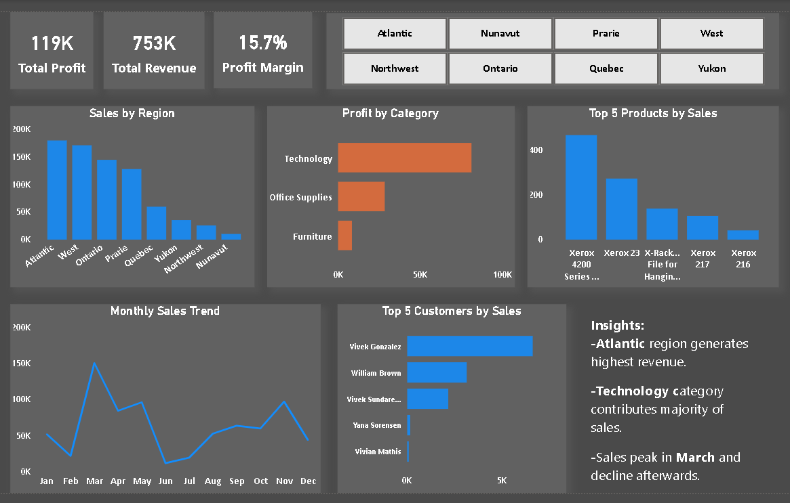

# 📊 Sales Data Analysis Dashboard

## 🔹 Project Overview
This project demonstrates end-to-end data analysis using SQL, Python, and Power BI.

## 🔹 Tools Used
- SQL (MySQL)
- Python (Pandas, Matplotlib)
- Power BI

## 🔹 Key Analysis
- Customer Lifetime Value
- Sales by Region
- Profit by Category
- Monthly Sales Trends
- Top Products & Customers

## 🔹 Dashboard

## 🔹 Insights
- Atlantic region generates highest revenue
- Technology category contributes majority of sales
- Sales peak in March and decline afterwards

## 🔹 Files Included
- SQL Queries
- Dataset (CSV)
- Power BI Dashboard (.pbix)
- Python Analysis Notebook

## 🔹 Author
Om Patil
